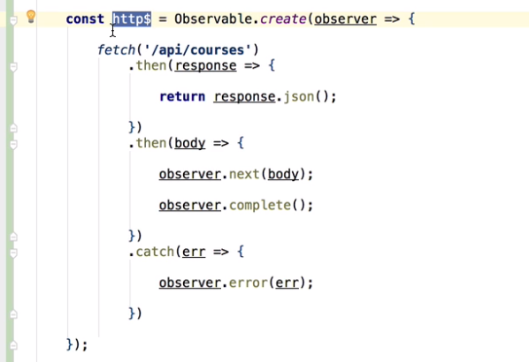
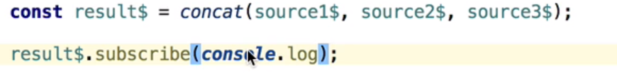

# RXJS Cheat Sheet

## Understanding RxJs - What are streams?

core notion of RxJs is stream of values, before understanding observables, first Stream of values should be understood. Lets take an example of an click event triggered


It emits a stream of multiple values on every click.

Its the same for setInterval\(\) which will be calling the function inside for every 'x' seconds. This also emits a stream of values.


so you guys may be confused why am i explaining this is RxJs Course let me get into it.🙂

### **What is RxJs?**

If we wish to trigger set interval after every 3 seconds of a mouse click event then we need to nest 3 stream of values/callbacks which sometimes leads to **callback hell.**


If mouse double clicked here then two streams are emitted. Here we ne

ed a multiple stream of values to be connected and respond to events, http requests , timeouts and intervals.

Instead of using native callbacks, **RxJs library is introduced to combine multiple stream of values in maintainable way.**

### **Whats is RxJs Observable?**

To define a stream which emits values Observable is used in RxJs or in simple terms Observables are the definition/blueprint of stream of values.

Below interval$ of type Observable is defined which will emit numbers


if Observable need to emit stream of values then we should subscribe it like how we subscribe to Netflix/amazon prime😉


**interval\(\)** is a function from RxJs library which emits series of number values.

### **3 Core RxJs Concepts - Error, Completion and Subscriptions**

* subscription : callback which emits the stream of values
* error : when the stream of values combined didn't work properly and throws an error than error callback is called.
* complete : completion callback is called when stream of values are completely emitted successfully.

Note: Both error and completion cannot happen, either one of those will be triggered based on the stream of values emitted successfully or failed.

### **Observables under the hood**

* lets take an example by calling an api using fetch api


fetch is a promise, it is very different from observables it gets executed when defined.

Lets create a **custom observable** and include this above promise request inside that observable.

```jsx
Observable.create() // this create function is used to create custom observable
```

fetch function getting courses is included into the create function of an observable and fetch function takes one parameter known as **observer**.

**Observer** is the one which allows to emit stream of values, or throw error and also trigger when function gets completed and it is kept private. Its is defined inside observable.

**Observable** doesn't allow values to emit on its behalf we can only subscribe and get stream of values.

Observer functions to emit, complete and throwing error.

next\(\):

```jsx
observer.next() // function which emits values
```

complete\(\) :

```jsx
observer.complete() //function which emits complete value
```

error\(\):

```jsx
observer.error();
```

Custom Http Observable with the promise function fetch code is below



### **What is the use of converting promise into an Observable ?**

As we converted a promise into a Observable which means a stream of values. this stream can be combined with many Rxjs operators which parallelly states that it can combine many streams like set interval, set timeout and other apis with HTTP Observable.

### **RxJs Operator - Map operator**

Operator is a way of deriving one Observable from another observable

Map operator takes an input observable and converts into to an another Observable based on the operator specified.

Passing a chain or stream of values to map function is done through pipe function.

Below code converts the payload data to array using map functionality


### **Building components with RxJs - Imperative design**

In the above example lets say we need to categorize the courses into two categories beginner and advanced so that we will declare two courses array and filter inside the subscribe method.


* Too much of logic inside the subscribe method doesn't help good in scaling complexity which leads to nested subscribe call and reach callback hell. Its not recommended to use nested subscribe also.

Above is the imperative design or approach to filter categories inside the subscribe method.

### **Building components with RxJs - Reactive design**

Create 2 observables Beginner and advanced ,which is a definition and its not directly mutable and then use map operator to filter. this wont create nested subscriptions.


To display it in Html using async pipe

**async :** Angular pipe which directly subscribe to observable and emits stream of values directly to html


### **sharereplay and tap operator :**

In the above example we have defined two observables \(beginner and advanced\) and these observables are each subscribed using async pipe . here we have two different subscriptions derived from same http$ Observable which leads to two http calls to backend which is not a feasible scenario.

To avoid multiple http requests we will use new operator sharereplay which shares the existing stream of data to all subscriptions instead of creating new.


If any logs to be produced while stream of values are emitted then tap\(\) operator is used which will produce side effects while performing observable operations.


### **Observable Concatenation - InDepth explanation**

lets define three observable which emits series of numbers if subscribed . We will concat them sequentially


**of\(\) :** this function is helpful for defining al**l type of observables**

**concat\(\)** : concat function which combines stream of values will subscribe internally to the above observables and concat them only when the successor subscription completes.


Below example concatinates 3 observables sequentially. If Observable source2$ gets concatinated with source1$ only when the source1$ stops emiting values.



### **Form Draft Pre-Save Example and the RxJs Filter Operator**

Let say we have one form which has some form fields as below example and user needs to auto save the draft.


angular provides a form which is observable


form has a link to value observable which can connect to other observables.

Now the form field as we know its a stream of values it should be filtered and we need to get only the valid form data using **filter\(\)** RxJs operator. this will filter out the valid forms.


This is the first stream of values which should be combined or concatenated with second stream which will call backend api and save the draft every time any changes occur. here is the code which will combine above form Observable changes with the Http request observable. This is the practical example for Observable concatenation

first we will define a Observable which calls the Http put request to save the draft form and put inside a function like below


savecourse is a method which returns observable which takes form 'changes' as an input and call an http put request.

**fromPromise\(\) :** function of rxjs which converts promise call into an observable.

after defining an second stream of observable both stream of observables should be concatenated via concatMap operator.

**concatMap :** Rxjs operator which takes an stream of source observable and combines with the derived observable. Second input value of source observable is concatenated with derived observable only when first value of source observable completes its operation with derived observable.


Here whenever the form data is edited many times, many http requests will be triggered continuously in parallel. It should be avoided. Http request should be called only previous request is completed so to achieve this concatMap is used as below.


### **Understanding the merge Observable combination Strategy**

**merge** : Rxjs operator which combines multiple observable to convert into a an observable which will have stream of values emitted whenever a new values emitted in any input observable


**mergeMap** :

Maps each value from stream emitted to an Observable whenever value is emitted it doesn't wait for the previous value of source variable operation to get completed.


* Practically used in calling multiple Http requests at the same time.

**exhaust map :**

Rxjs operator which ignores source observable emitted value when previous value of source observable is still not completed operation with derived observable. below example 5 is ignored.


**practical use case** : Multiple times button click will lead to multiple asynchronous calls to avoid those exhaust map is used so that until the operation of first value gets completed, other values emitted will be ignored.


### **Unsubscription In Detail - Implementing a Cancellable HTTP Observable**

* If Httprequest should be cancelled for onflight requests then unsubscribe\(\) should be used for the type subscription.
* There are some Observables which cancellable logic should be written using AbortController.


**debounceTime and distinct until changed:**

If using a search option and search text is directly calling Http requests, observable will emits new value when a new character is added in search text and it creates huge backend requests to avoid debounceTime will be used.

debounce Rxjs operator takes an input argument of time to wait, When one value is emitted then operator wait until the that time ends to emit the new value of the observable.


distinct until changed : if search box emitting same value than to stop calling duplicate requests with same value we will use this operator

fromevent : converts events into observables


switchmap operator: Rxjs Operator which unsubscribes previous value of source observable and subscribes to new value when emitted. Helpful in search functionality


Rxjs Error Handling strategy

catchError: provide an alternative source when error occurred and continue the observable errored out to complete.


throwerror\(\) : function which returns the observable which emits the value of error used inside catchError block to emit the error outside as an observable.


**retrywhen:** retry when operator is used to call Http request after an previous http request throw an error

**startwith:** startwith operator is used to initiate the stream with the starting value instead of concat and rest all based on input element event.


### **RxJs Throttling**

* Throttle time is to limit the values coming from the source observable and send only one value for a period of time and leave other values until the time elapses. It can be mainly used for fetching the data from the web page continuously and limit  multiple values coming across the stream

### **Custom Debug RxJs Operator for Tap Rxjs Operat**or :

This will log data based on levels. Code is to demonstrate how to create custom rxjs operator .

Its a higher order function which contains two functions where first function you will sending parameters what is needed and second function parameters contain source observble.


Usage of Debug Rxjs Operator


**RxJs ForkJoin operator**

forkjoin Rxjs operator is used to call parallel operations at a same time and receive the observables. Helpful in completing large running tasks.


## Subjects and Stores

**Notion of Subject :**

Subject is a combination of both Observable and observer which has all properties of emitting values and subscribing. It has no unsubscribe logic to our observable shared from subject.

Subject is a best way to create custom Observable and also to multicast


**Behavioral subject**

supports late subscription by emitting providing last value to the subscriber


**Async Subject:**

Subject emits values after completion of subject. Async subject will emit last value when completed.


**Replay Subject**

Subject emits complete values after subscription.

Hope this cheat sheet works I added almost every example I could add. this could help understanding most of the topics involved in RxJs.

